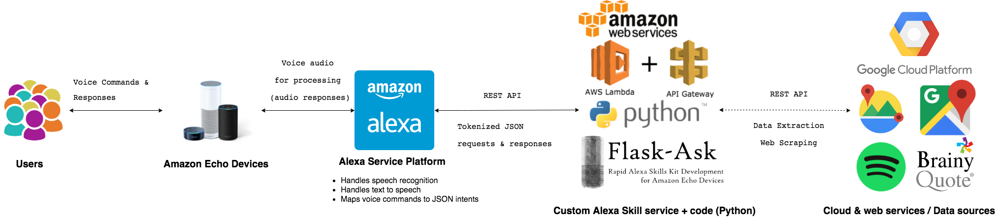

# Utopia: An Alexa skill that helps with depression

Utopia is the name of the Alexa skill that is designed to help people with depression.

## Architecture

## What is Utopia?

***Libellus vere aureus, nec minus salutaris quam festivus, de optimo rei publicae statu deque nova insula Utopia***

The term was first coined by Thomas Moore (1478–1535), and was originally a fictional book
that described a perfect world. 

Utopia is the idea of a perfect place that has been designed to have no problems.

## Description

According to the [World Health Organization](http://www.who.int/mediacentre/factsheets/fs369/en/), 350 million people worldwide
suffer from depression. Depression is the leading cause of disability.

This skill is meant to help people who are going through depression. The main feature of this skill involves taking
the [Hamilton Depression Rating Scale Survey](https://www.psychcongress.com/saundras-corner/scales-screeners/depression/hamilton-depression-rating-scale-ham-d) to get a general idea of the severity of depression, and based on the score
of the survey, the skill would recommend certain natural remedies to help. The other complementary features include giving 
positive and motivational quotes (other types of quotes are also supported), proposing natural solutions 
(exercising, going out, talking to family & friends, and much more), a mindfulness meditation exercise, 
recommendations for nearby therapists, and, if necessary, getting help from the National Suicide Prevention Lifeline. 

**Disclaimer**: Utopia is not meant to be a substitute for professional medical advice, treatment or diagnosis. 
It is more of a supplemental and informational helper to mitigate depression. The people who programmed this are not experts in mental illnesses such as depression,
and this is a product of our subjectivity and couple months of basic research on depression.

## Technology

Utopia is powered by Python, [Flask-Ask](http://flask-ask.readthedocs.io/en/latest/) (an extension of [Flask](http://flask.pocoo.org/docs/0.12/), 
a micro web framework), and the Alexa Skills kit.

## How to use
To start using it, say a simple invocation phrase, such as the following listed below:

| Starting Phrase                          | Example                              |
|------------------------------------------|--------------------------------------|
| \<invocation name>                        | Alexa, Utopia                        |
| Ask \<invocation name>                    | Alexa, Ask Utopia                    |
| Begin \<invocation name>                  | Alexa, Begin Utopia                  |
| Launch \<invocation name>                 | Alexa, Launch Utopia                |
| Load \<invocation name>                   | Alexa, Load Utopia                   |
| Open \<invocation name>                   | Alexa, Open Utopia                   |
| Play \<invocation name>                   | Alexa, Play Utopia                   |
| Resume \<invocation name>                 | Alexa, Resume Utopia                 |
| Run \<invocation name>                    | Alexa, Run Utopia                    |
| Start \<invocation name>                  | Alexa, Start Utopia                  |
| Tell \<invocation name>                   | Alexa, Tell Utopia                   |
| Use \<invocation name>                    | Alexa, Use Utopia                    |

To just start and see the available features, you can say the following:

**Alexa, start Utopia and help**

## To Be Continued...
I will add more to this as I get farther into the project.

